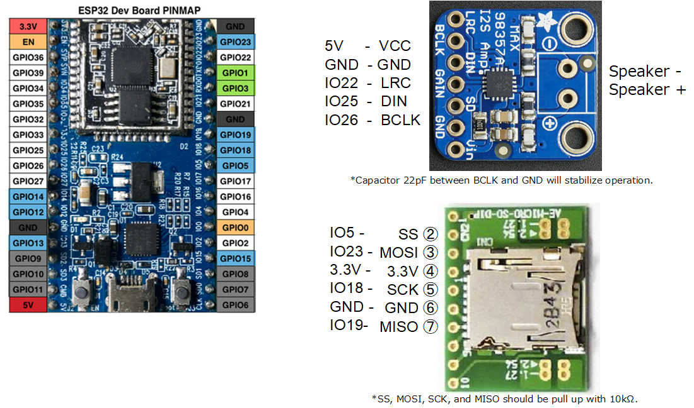

# esp32_MusicPlayer

## Prepare
- [ESP32-DevKitC](https://www.espressif.com/en/products/hardware/esp32-devkitc/overview)  : espressif
- [Adafruit I2S 3W Class D Amplifier Breakout - MAX98357A](https://www.adafruit.com/product/3006) : Adafruit
- [Stereo Enclosed Speaker Set - 3W 4 Ohm](https://www.adafruit.com/product/1669) : Adafruit
- [AE-MICRO-SD-DIP](http://akizukidenshi.com/catalog/g/gK-05488/) Micro SD Card slot : Akizuki Denshi

## Wiring

## Development Environment
- [Arduino IDE](https://www.arduino.cc/en/main/software)
- [arduino-esp32](https://github.com/espressif/arduino-esp32)

## How to use
Set SD card with "sound.wav" (44100Hz, 16bit, stereo, linear PCM).
Only turn on the power.
